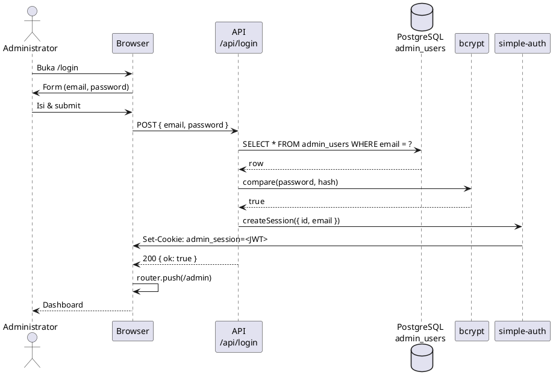

# Sequence Diagram

Dokumen ini memuat diagram urutan (sequence diagram) untuk aplikasi Face Analytic. Diagram dapat digambar ulang di [PlantUML](https://www.plantuml.com/plantuml/uml) atau [PlantText](https://www.planttext.com/).

---

## Daftar Diagram

1. [Melakukan Analisis Kulit (Karyawan/User)](#1-sequence-diagram-melakukan-analisis-kulit-karyawanuser)
2. [Melihat Hasil & Rekomendasi (Karyawan/User)](#2-sequence-diagram-melihat-hasil--rekomendasi-karyawanuser)
3. [Login (Administrator)](#3-sequence-diagram-login-administrator)
4. [Melihat Riwayat Analisis (Administrator)](#4-sequence-diagram-melihat-riwayat-analisis-administrator)
5. [Melihat Laporan (Administrator)](#5-sequence-diagram-melihat-laporan-administrator)
6. [Ekspor Laporan (Administrator)](#6-sequence-diagram-ekspor-laporan-administrator)
7. [Kelola Data Produk (Administrator)](#7-sequence-diagram-kelola-data-produk-administrator)
8. [Kelola Kandungan Produk (Administrator)](#8-sequence-diagram-kelola-kandungan-produk-administrator)
9. [Kelola Brand Produk (Administrator)](#9-sequence-diagram-kelola-brand-produk-administrator)

---

## 1. Sequence Diagram Melakukan Analisis Kulit (Karyawan/User)

**Deskripsi:** User melakukan analisis kulit wajah melalui kamera atau upload gambar. Inferensi (deteksi wajah & klasifikasi kulit) berjalan di browser (client-side), tidak mengirim foto ke server.

### Alur (Mode Kamera)

```
User -> Browser: Buka halaman utama (/)
Browser -> User: Tampilkan CameraPanel (kamera live / upload)

User -> CameraPanel: Pilih mode "Live Capture"
CameraPanel -> Browser: getUserMedia({ video: { facingMode: 'user' } })
Browser -> CameraPanel: MediaStream
CameraPanel -> User: Tampilkan video stream (mirror view)

User -> CameraPanel: Klik tombol "Capture"
CameraPanel -> skinAnalyzer: analyzeSkin(videoRef)
skinAnalyzer -> faceDetection: detectFaces(video)
faceDetection -> CNN Model: Deteksi wajah (TensorFlow.js)
CNN Model -> skinAnalyzer: { faceDetected, boundingBox }

alt Wajah terdeteksi
    skinAnalyzer -> cnnSkinClassifier: classifySkin(imageData)
    cnnSkinClassifier -> CNN Model: Klasifikasi kulit (acne/normal/oily/dry)
    CNN Model -> skinAnalyzer: { label, probabilities, confidence }
    skinAnalyzer -> skinAnalyzer: probabilitiesToScores(), formatLabel()
    skinAnalyzer -> CameraPanel: AnalysisResult { skinType, scores, faceDetected: true }
else Wajah tidak terdeteksi
    skinAnalyzer -> CameraPanel: AnalysisResult { faceDetected: false }
end

CameraPanel -> API: POST /api/dataset { imageData, scores, skinType }
API -> DB: INSERT INTO dataset (opsional, untuk pengayaan data)
API -> CameraPanel: 200 OK

CameraPanel -> Page: onCapture(result)
Page -> ResultPanel: skinType, scores, faceDetected
Page -> RecommendationCard: skinType
Browser -> User: Tampilkan hasil analisis & rekomendasi
```

### Alur (Mode Upload)

```
User -> CameraPanel: Pilih mode "Upload Gambar"
User -> CameraPanel: Pilih file (JPG/PNG, max 3MB)

CameraPanel -> Browser: FileReader.readAsDataURL(file)
Browser -> CameraPanel: base64 image
CameraPanel -> User: Tampilkan preview gambar

User -> CameraPanel: Klik tombol "Capture"
CameraPanel -> Canvas: drawImage(img)
CameraPanel -> faceDetection: detectFaces(canvas)
faceDetection -> CNN Model: Deteksi wajah
CNN Model -> faceDetection: { faceDetected }

alt Wajah terdeteksi
    CameraPanel -> cnnSkinClassifier: classifySkin(imageData)
    cnnSkinClassifier -> CNN Model: Klasifikasi kulit
    CNN Model -> CameraPanel: AnalysisResult
else Wajah tidak terdeteksi
    CameraPanel -> User: "Wajah tidak terdeteksi"
end

CameraPanel -> API: POST /api/dataset (jika wajah terdeteksi)
CameraPanel -> Page: onCapture(result)
Browser -> User: Tampilkan hasil
```

### Komponen Penting

- **CameraPanel** (`src/components/CameraPanel.tsx`) — UI capture, panggil `analyzeSkin`
- **skinAnalyzer** (`src/lib/skinAnalyzer.ts`) — `captureFrame`, `detectFacePresenceWithCNN`, `classifySkin`
- **faceDetection** (`src/lib/faceDetection.ts`) — `detectFaces` (CNN)
- **cnnSkinClassifier** (`src/lib/cnnSkinClassifier.ts`) — `classifySkin`, model `public/models/skin-classifier/`
- **API** — `POST /api/dataset` untuk simpan ke dataset (opsional)

---

## 2. Sequence Diagram Melihat Hasil & Rekomendasi (Karyawan/User)

**Deskripsi:** Setelah analisis selesai, User melihat skor kondisi kulit dan daftar produk rekomendasi.

```
User -> Page: Sudah dapat AnalysisResult dari onCapture
Page -> ResultPanel: props { skinType, scores, isAnalyzing, faceDetected }

ResultPanel -> User: Tampilkan:
  - Kondisi utama (badge skinType)
  - Skor per indikator (acne, blackheads, clear_skin, dark_spots, puffy_eyes, wrinkles)
  - Bar visual untuk tiap skor 0–100%

alt faceDetected = true
    Page -> RecommendationCard: props { skinType }
    RecommendationCard -> API: GET /api/products
    API -> DB: SELECT * FROM products (JOIN brands, dll)
    DB -> API: rows
    API -> RecommendationCard: JSON [ products ]
    RecommendationCard -> RecommendationCard: products.slice(0, 3)
    RecommendationCard -> User: Tampilkan top 3 rekomendasi produk (nama, brand, deskripsi)
else faceDetected = false
    Page -> User: Tidak render RecommendationCard (atau tampilkan pesan "Wajah tidak terdeteksi")
end
```

### Komponen Penting

- **ResultPanel** (`src/components/ResultPanel.tsx`) — Tampilkan skinType & scores (data dari parent, tanpa API)
- **RecommendationCard** (`src/components/RecommendationCard.tsx`) — `GET /api/products`, tampilkan top 3
- **API** — `GET /api/products` → `getAllProducts()` dari data layer

---

## 3. Sequence Diagram Login (Administrator)

**Deskripsi:** Admin memasukkan email dan password, sistem memverifikasi ke tabel `admin_users` dan membuat session JWT.

```
Administrator -> Browser: Buka /login
Browser -> Administrator: Tampilkan form login (email, password)

Administrator -> Browser: Isi email & password, klik "Masuk"
Browser -> API: POST /api/login
  Body: { email: string, password: string }

API -> API: email.toLowerCase().trim()
API -> DB: SELECT id, email, password_hash FROM admin_users WHERE email = $1
DB -> API: row (id, email, password_hash) atau null

alt Row ditemukan
    API -> bcrypt: compare(password, row.password_hash)
    bcrypt -> API: true/false

    alt Password benar
        API -> simple-auth: createSession({ id, email })
        simple-auth -> jose: SignJWT({ id, email }).sign(SECRET)
        simple-auth -> cookies: set('admin_session', token, { httpOnly, maxAge: 7d })
        API -> Browser: 200 { ok: true }
        Browser -> Browser: router.push('/admin'), router.refresh()
        Browser -> Administrator: Redirect ke /admin (Dashboard)
    else Password salah
        API -> Browser: 401 { error: "Email atau password salah" }
        Browser -> Administrator: Tampilkan pesan error
    end
else Row tidak ditemukan
    API -> Browser: 401 { error: "Email atau password salah" }
    Browser -> Administrator: Tampilkan pesan error
end
```

### Proteksi Route Admin

```
Administrator -> Browser: Akses /admin/*
Browser -> Middleware: Request ke /admin
Middleware -> API: GET /api/auth/session (dengan cookie)
API -> cookies: get('admin_session')
API -> jose: jwtVerify(token, SECRET)
API -> Middleware: { user: { id, email } } atau null

alt Session valid
    Middleware -> Browser: NextResponse.next() — izinkan akses
else Session invalid / null
    Middleware -> Browser: Redirect(302) ke /login?callbackUrl=/admin/...
    Browser -> Administrator: Tampilkan form login
end
```

### Komponen Penting

- **Login Page** (`src/app/login/page.tsx`) — Form, `POST /api/login`
- **API Login** (`src/app/api/login/route.ts`) — Query `admin_users`, bcrypt, `createSession`
- **simple-auth** (`src/lib/simple-auth.ts`) — `createSession`, `getSession`, `destroySession`
- **Middleware** (`middleware.ts`) — Cek session via `/api/auth/session`, redirect jika belum login

---

## 4. Sequence Diagram Melihat Riwayat Analisis (Administrator)

**Deskripsi:** Admin membuka halaman Reports untuk melihat riwayat analisis dengan filter opsional.

```
Administrator -> Browser: Buka /admin/reports
Browser -> Admin Layout: Render ReportsAdmin (perlu session)

ReportsAdmin -> Server Actions: getAnalysisLogsAction()
Server Actions -> Data Layer: getAllAnalysisLogs()
Data Layer -> DB: SELECT * FROM analysis_logs ORDER BY created_at DESC
DB -> Data Layer: rows
Data Layer -> ReportsAdmin: AnalysisLog[]

ReportsAdmin -> ReportsAdmin: setLogs(logs)

Administrator -> Browser: Pilih filter (Start Date, End Date, Condition, Product)
Browser -> ReportsAdmin: handleFilterChange
ReportsAdmin -> ReportsAdmin: setFilter({ startDate, endDate, skinCondition, productId })
ReportsAdmin -> ReportsAdmin: filteredLogs = logs.filter(...) — filter client-side

ReportsAdmin -> User: Tampilkan tabel riwayat:
  - Kolom: User, Date, Condition, Recommended Products, Actions
  - Badge kondisi (oily/dry/acne/normal)
  - Data dari filteredLogs
```

### Alternatif: Menggunakan API (jika pakai filter server-side)

```
ReportsAdmin -> API: GET /api/analysis-logs?startDate=...&endDate=...&condition=...
API -> Data Layer: getAnalysisLogsByDateRange() / getAnalysisLogsByCondition() / getAllAnalysisLogs()
Data Layer -> DB: SELECT ...
DB -> API: rows
API -> ReportsAdmin: JSON logs
```

### Komponen Penting

- **Reports Page** (`src/app/admin/reports/page.tsx`) — `getAnalysisLogsAction()`, filter client-side
- **Actions** (`src/app/admin/actions.ts`) — `getAnalysisLogsAction` → `getAllAnalysisLogs()`
- **API** (`src/app/api/analysis-logs/route.ts`) — `GET` dengan query `startDate`, `endDate`, `condition`

---

## 5. Sequence Diagram Melihat Laporan (Administrator)

**Deskripsi:** Admin melihat ringkasan laporan (Top Products, distribusi kondisi kulit) di halaman Reports.

```
Administrator -> Browser: Buka /admin/reports
Browser -> ReportsAdmin: Mount

ReportsAdmin -> Server Actions: Promise.all([
  getAnalysisLogsAction(),
  getProductsAction(),
  getSkinTypesAction()
])

Server Actions -> Data Layer: getAllAnalysisLogs(), getAllProducts(), getAllSkinTypes()
Data Layer -> DB: SELECT FROM analysis_logs, products, skin_types
DB -> Server Actions: rows
Server Actions -> ReportsAdmin: [ logs, products, skinTypes ]

ReportsAdmin -> ReportsAdmin: generateMostRecommendedReport()
  - Loop logs, parse recommended_product_ids
  - Hitung frekuensi per product_id
  - Sort descending, slice(0, 5)

ReportsAdmin -> ReportsAdmin: generateMostCommonSkinTypes()
  - Loop logs, aggregate dominant_condition
  - Sort descending

ReportsAdmin -> User: Tampilkan:
  - Filter bar (date, condition, product)
  - Card "Top Products" — 5 produk paling sering direkomendasikan
  - Card "Skin Type Distribution" — distribusi oily/dry/acne/normal
  - Tabel riwayat analisis (filtered)
```

### Komponen Penting

- **Reports Page** (`src/app/admin/reports/page.tsx`) — `getAnalysisLogsAction`, `getProductsAction`, `getSkinTypesAction`
- **generateMostRecommendedReport**, **generateMostCommonSkinTypes** — fungsi client-side untuk agregasi

---

## 6. Sequence Diagram Ekspor Laporan (Administrator)

**Deskripsi:** Admin mengekspor data analisis ke file CSV atau JSON (dan opsional XLSX/PDF jika tersedia).

### Ekspor CSV

```
Administrator -> Browser: Buka /admin/export
Administrator -> Browser: Klik "Export CSV"

Browser -> API: GET /api/reports/export-csv
API -> Data Layer: getAllAnalysisLogs(), getAllProducts()
Data Layer -> DB: SELECT FROM analysis_logs, products
DB -> API: rows

API -> API: Bangun CSV (header + rows)
  - Kolom: ID, Date, Skin Condition, Recommended Product, User
  - Map product_id ke product name

API -> Browser: Response (Content-Type: text/csv, Content-Disposition: attachment)
Browser -> Browser: Buat blob, URL.createObjectURL, trigger download
Browser -> Administrator: Unduh file face_analysis_report.csv
```

### Ekspor JSON

```
Administrator -> Browser: Klik "Export JSON"
Browser -> API: GET /api/reports/export-json
API -> Data Layer: getAllAnalysisLogs(), getAllProducts(), getAllSkinTypes()
Data Layer -> DB: SELECT ...
DB -> API: rows

API -> API: JSON.stringify({ logs, products, skinTypes })
API -> Browser: Response (Content-Type: application/json, attachment)
Browser -> Administrator: Unduh file face_analysis_report.json
```

### Ekspor XLSX / PDF (jika endpoint tersedia)

```
Browser -> API: GET /api/reports/export-xlsx
API -> Library: Generate Excel (xlsx)
API -> Browser: Blob (application/vnd.openxmlformats-officedocument.spreadsheetml.sheet)
Browser -> Administrator: Unduh file

Browser -> API: GET /api/reports/export-pdf
API -> Library: Generate PDF
API -> Browser: Blob (application/pdf)
Browser -> Administrator: Unduh file
```

### Komponen Penting

- **Export Page** (`src/app/admin/export/page.tsx`) — Tombol Export CSV, Export JSON
- **API** — `GET /api/reports/export-csv`, `GET /api/reports/export-json`
- **export-csv** (`src/app/api/reports/export-csv/route.ts`) — `getAllAnalysisLogs`, `getAllProducts`, format CSV
- **export-json** (`src/app/api/reports/export-json/route.ts`) — Export data lengkap ke JSON

---

## 7. Sequence Diagram Kelola Data Produk (Administrator)

**Deskripsi:** Admin CRUD produk (Create, Read, Update, Delete) melalui halaman Products dengan server actions.

### Baca Daftar Produk

```
Administrator -> Browser: Buka /admin/products
ProductsAdmin -> Server Actions: getProductsAction(), getBrandsAction(), getCategoriesAction(), getIngredientsAction()

Server Actions -> Data Layer: getAllProducts(), getAllBrands(), getAllCategories(), getAllIngredients()
Data Layer -> DB: SELECT FROM products, brands, product_categories, ingredients (JOIN product_ingredients)
DB -> Server Actions: rows
Server Actions -> ProductsAdmin: [ products, brands, categories, ingredients ]

ProductsAdmin -> User: Tampilkan tabel produk + form tambah/edit
```

### Buat Produk Baru

```
Administrator -> ProductsAdmin: Klik "Add Product", isi form (name, brand_id, category_id, description, image_url, ingredient_ids)
Administrator -> ProductsAdmin: Klik "Create"

ProductsAdmin -> Server Actions: createProductAction(data)
Server Actions -> Data Layer: createProduct({ name, brand_id, category_id, description, image_url, ingredient_ids })
Data Layer -> DB: INSERT INTO products (...)
Data Layer -> DB: INSERT INTO product_ingredients (product_id, ingredient_id) untuk tiap ingredient
DB -> Data Layer: product id
Data Layer -> Server Actions: id
Server Actions -> Server Actions: revalidatePath('/admin/products')
Server Actions -> ProductsAdmin: { success: true, id }

ProductsAdmin -> ProductsAdmin: fetchData() — refresh tabel
ProductsAdmin -> User: Tampilkan produk baru di tabel
```

### Update Produk

```
Administrator -> ProductsAdmin: Klik "Edit" pada produk
ProductsAdmin -> Server Actions: getProductIngredientsAction(productId)
Server Actions -> Data Layer: getProductIngredients(productId)
Data Layer -> DB: SELECT FROM product_ingredients
ProductsAdmin -> User: Tampilkan form edit dengan data terisi

Administrator -> ProductsAdmin: Ubah data, klik "Update"
ProductsAdmin -> Server Actions: updateProductAction(id, data)
Server Actions -> Data Layer: updateProduct(id, data)
Data Layer -> DB: UPDATE products SET ... WHERE id = ?
Data Layer -> DB: Sync product_ingredients (hapus lama, insert baru)
Server Actions -> ProductsAdmin: { success: true }
ProductsAdmin -> ProductsAdmin: fetchData()
ProductsAdmin -> User: Tabel ter-update
```

### Hapus Produk

```
Administrator -> ProductsAdmin: Klik "Delete"
Browser -> Administrator: confirm("Are you sure...?")

Administrator -> ProductsAdmin: Konfirmasi "OK"
ProductsAdmin -> Server Actions: deleteProductAction(id)
Server Actions -> Data Layer: deleteProduct(id)
Data Layer -> DB: DELETE FROM product_ingredients WHERE product_id = ?
Data Layer -> DB: DELETE FROM products WHERE id = ?
Server Actions -> ProductsAdmin: { success: true }
ProductsAdmin -> ProductsAdmin: fetchData()
ProductsAdmin -> User: Produk hilang dari tabel
```

### Komponen Penting

- **ProductsAdmin** (`src/app/admin/products/page.tsx`) — UI, panggil server actions
- **actions.ts** — `getProductsAction`, `createProductAction`, `updateProductAction`, `deleteProductAction`
- **Data Layer** — `getAllProducts`, `createProduct`, `updateProduct`, `deleteProduct`, `getProductIngredients`

---

## 8. Sequence Diagram Kelola Kandungan Produk (Administrator)

**Deskripsi:** Admin CRUD ingredients (kandungan produk) dengan bobot per tipe kulit (oily, dry, normal, acne).

### Baca Daftar Ingredients

```
Administrator -> Browser: Buka /admin/ingredients
IngredientsAdmin -> Server Actions: getIngredientsAction()

Server Actions -> Data Layer: getAllIngredients()
Data Layer -> DB: SELECT * FROM ingredients
DB -> Server Actions: rows
Server Actions -> IngredientsAdmin: Ingredient[]

IngredientsAdmin -> User: Tampilkan tabel (nama, effect, weights O/D/N/A, actions)
```

### Buat Ingredient Baru

```
Administrator -> IngredientsAdmin: Klik "Add Ingredient"
IngredientsAdmin -> User: Tampilkan form

Administrator -> IngredientsAdmin: Isi name, effect, w_oily, w_dry, w_normal, w_acne
Administrator -> IngredientsAdmin: Klik "Create"

IngredientsAdmin -> Server Actions: createIngredientAction(formData)
Server Actions -> Data Layer: createIngredient({ name, effect, w_oily, w_dry, w_normal, w_acne })
Data Layer -> DB: INSERT INTO ingredients (...)
DB -> Server Actions: id
Server Actions -> Server Actions: revalidatePath('/admin/ingredients')
Server Actions -> IngredientsAdmin: { success: true }
IngredientsAdmin -> IngredientsAdmin: fetchData()
IngredientsAdmin -> User: Ingredient baru muncul di tabel
```

### Update Ingredient

```
Administrator -> IngredientsAdmin: Klik "Edit"
IngredientsAdmin -> User: Form terisi dengan data ingredient

Administrator -> IngredientsAdmin: Ubah data, klik "Update"
IngredientsAdmin -> Server Actions: updateIngredientAction(id, formData)
Server Actions -> Data Layer: updateIngredient(id, data)
Data Layer -> DB: UPDATE ingredients SET ... WHERE id = ?
Server Actions -> IngredientsAdmin: { success: true }
IngredientsAdmin -> IngredientsAdmin: fetchData()
```

### Hapus Ingredient

```
Administrator -> IngredientsAdmin: Klik "Delete"
Browser -> Administrator: confirm(...)
Administrator -> IngredientsAdmin: Konfirmasi

IngredientsAdmin -> Server Actions: deleteIngredientAction(id)
Server Actions -> Data Layer: deleteIngredient(id)
Data Layer -> DB: DELETE FROM ingredients WHERE id = ?
Server Actions -> IngredientsAdmin: { success: true }
IngredientsAdmin -> IngredientsAdmin: fetchData()
```

### Komponen Penting

- **IngredientsAdmin** (`src/app/admin/ingredients/page.tsx`)
- **actions.ts** — `getIngredientsAction`, `createIngredientAction`, `updateIngredientAction`, `deleteIngredientAction`
- **Data Layer** — `getAllIngredients`, `createIngredient`, `updateIngredient`, `deleteIngredient`

---

## 9. Sequence Diagram Kelola Brand Produk (Administrator)

**Deskripsi:** Admin CRUD brand produk (nama, logo URL).

### Baca Daftar Brands

```
Administrator -> Browser: Buka /admin/brands
BrandsAdmin -> Server Actions: getBrandsAction()

Server Actions -> Data Layer: getAllBrands()
Data Layer -> DB: SELECT * FROM brands
DB -> Server Actions: rows
Server Actions -> BrandsAdmin: Brand[]

BrandsAdmin -> User: Tampilkan tabel (nama, logo, actions)
```

### Buat Brand Baru

```
Administrator -> BrandsAdmin: Klik "Add Brand"
BrandsAdmin -> User: Tampilkan form

Administrator -> BrandsAdmin: Isi name, logo_url (opsional)
Administrator -> BrandsAdmin: Klik "Create"

BrandsAdmin -> Server Actions: createBrandAction({ name, logo_url })
Server Actions -> Data Layer: createBrand({ name, logo_url })
Data Layer -> DB: INSERT INTO brands (name, logo_url)
DB -> Server Actions: id
Server Actions -> Server Actions: revalidatePath('/admin/brands')
Server Actions -> BrandsAdmin: { success: true }
BrandsAdmin -> BrandsAdmin: fetchData()
BrandsAdmin -> User: Brand baru di tabel
```

### Update Brand

```
Administrator -> BrandsAdmin: Klik "Edit"
BrandsAdmin -> User: Form terisi

Administrator -> BrandsAdmin: Ubah name/logo_url, klik "Update"
BrandsAdmin -> Server Actions: updateBrandAction(id, data)
Server Actions -> Data Layer: updateBrand(id, data)
Data Layer -> DB: UPDATE brands SET ... WHERE id = ?
Server Actions -> Server Actions: revalidatePath('/admin/brands'), revalidatePath('/admin/products')
Server Actions -> BrandsAdmin: { success: true }
BrandsAdmin -> BrandsAdmin: fetchData()
```

### Hapus Brand

```
Administrator -> BrandsAdmin: Klik "Delete"
Browser -> Administrator: confirm(...)
Administrator -> BrandsAdmin: Konfirmasi

BrandsAdmin -> Server Actions: deleteBrandAction(id)
Server Actions -> Data Layer: deleteBrand(id)
Data Layer -> DB: DELETE FROM brands WHERE id = ?
Server Actions -> BrandsAdmin: { success: true }
BrandsAdmin -> BrandsAdmin: fetchData()
```

### Komponen Penting

- **BrandsAdmin** (`src/app/admin/brands/page.tsx`)
- **actions.ts** — `getBrandsAction`, `createBrandAction`, `updateBrandAction`, `deleteBrandAction`
- **Data Layer** — `getAllBrands`, `createBrand`, `updateBrand`, `deleteBrand`

---

## Cara Membuat Diagram Lengkap

1. Gunakan [PlantUML](https://www.plantuml.com/plantuml/uml) atau [PlantText](https://www.planttext.com/).
2. Untuk tiap skenario di atas, buat peserta (Actor, Component, API, DB) dan pesan berurutan.
3. Simpan file `.puml` di folder `docs/` untuk versi diagram yang bisa di-render.

### Contoh PlantUML (Login Admin)


